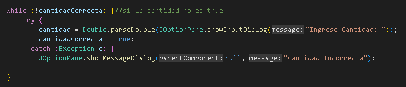
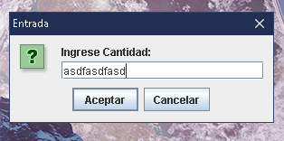
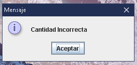

#  Conversor-Moneda-Alura-Challenge-Oracle-Next-Education !

## Desarrollo :blush:

Para el desarrollo del conversor se hizo uso primero de un ciclo while que encapsula el codigo del menu, de esta forma el usuario saldra 
del menu solamente cuando escoja que no desea continuar al finalizar la ejecucion del ciclo.

Para impedir que el usuario ingrese un valor que no es valido se implemento una exepcion que evalua si el valor ingresado por 
el usuario es de tipo double si no es asi el usuario recibira una notificacion que le avisara que la informacion ingresada no es valida y seguira
dentro de un bucle que le volvera a solicitar el valor hasta que sea de tipo double.

Ejemplo: tratare de ingresar un String en el campo

E imediatamente el programa reconocera que el valor ingresado no es valido

Tambien cree una clase con las diferentes divisas la cual retorna por medio de Getters el tipo de divisa que le sea solicitada pero tambien permite modificar
el valor de una divisa lo cual se podra usar en implementaciones futuras.

## Agradecimientos :punch:

Espero el proyecto les guste y cualquier aportacion sera bien recibida para mejorar el codigo.

- A Oracle por dar esta increible oportunidad de aprendizaje con su programa One next Education.
- A Alura Latam por cada uno de sus instructores y el gran conocimiento que imparten mediante cada uno de sus programas de formacion.

**Desarrollado por Mauricio Echeverria Rodriguez**
